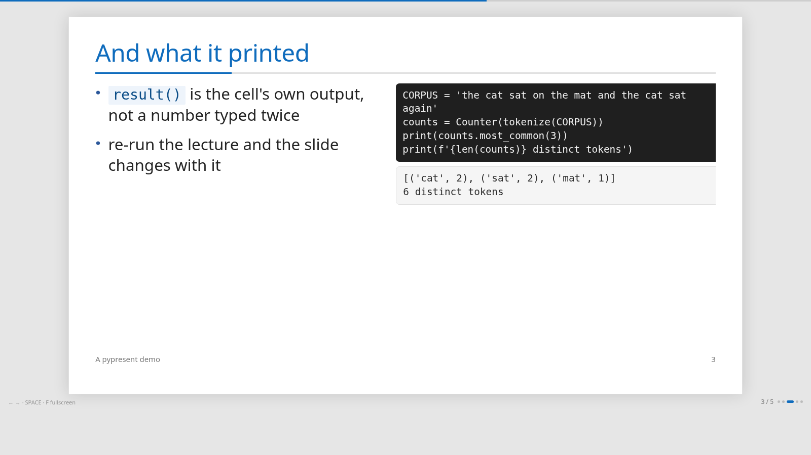
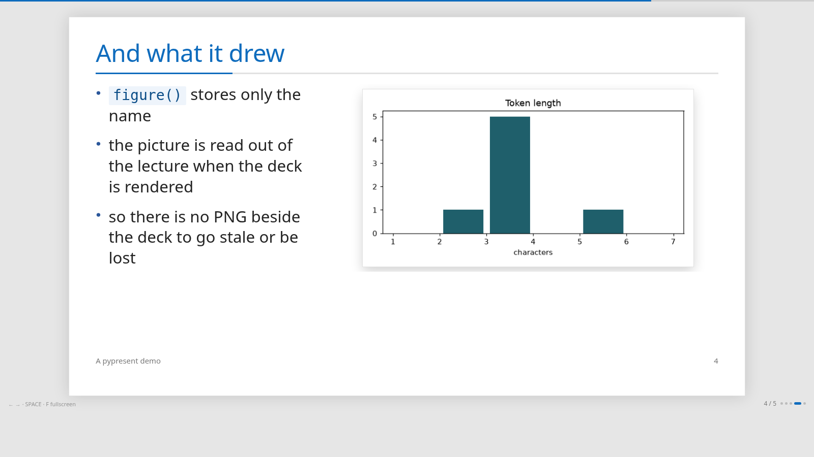

# pypresent

**The notebook is the slides.** `pypresent` turns a Jupyter notebook into one
self-contained HTML deck: no server, no build folder, no `_files/` directory,
nothing to upload. One file you can mail, open from a memory stick, or commit
next to the notebook it came from.

And the deck never pastes the code — it quotes the lecture, at build time.

[](https://github.com/Barakkol33/pypresent/actions/workflows/ci.yml)
[](https://pypi.org/project/pypresent/)
[](https://pypi.org/project/pypresent/)
[](LICENSE)

```bash
pip install pypresent            # rendering only - no Jupyter needed
pip install "pypresent[jupyter]" # and executing the notebooks
```

## The point of it

A lecture notebook and its deck usually drift apart: the code is pasted onto a
slide, the number beside it was true three runs ago, and the chart is a PNG
somebody exported in March.

`pypresent` never pastes. A cell in the lecture is named with a comment, and is
otherwise an ordinary cell that knows nothing about any deck — here `tokenize`
came from a cell above it:

```python
# slide: counts
from collections import Counter

CORPUS = 'the cat sat on the mat and the cat sat again'
counts = Counter(tokenize(CORPUS))
print(counts.most_common(3))
print(f'{len(counts)} distinct tokens')
```

Run the lecture and it prints:

```
[('cat', 2), ('sat', 2), ('mat', 1)]
6 distinct tokens
```

The deck then quotes that cell **by name**, and copies nothing:

```python
slide('''
## And what it printed

- `result()` is the cell's own output, not a number typed twice
- re-run the lecture and the slide changes with it
''',
    code('counts', drop=['from collections']),
    result('counts'),
    layout='split',
)
```

Then:

```bash
pypresent build                  # run the lecture, run the deck, write one html file
```

which is this slide — the listing is the code that ran, and the numbers under it
are the ones it printed:



`code()` is the listing, `result()` is what it printed, and `figure()` is what it
drew — a chart is code output the same way a number is, read out of the lecture's
stored output at render time, so there is no PNG beside the deck to go stale:



All three are resolved when the deck is built, so what a slide shows is what
actually ran — and a name that stops matching is reported by the build rather
than going quietly stale.

Both slides above are [`demos/05-notebook-slides.ipynb`](demos/05-notebook-slides.ipynb)
as it stands, rendered by `./demos/build.sh` and screenshotted by
[`demos/screenshot.sh`](demos/screenshot.sh).

## What a deck declares

The slide notebook says everything about itself in its first cell, so the
command line needs nothing but the file:

```python
from pypresent import Presentation, slide, code, result, figure

deck = Presentation(
    slides='talk-slides.ipynb',   # this notebook: nothing but slide() calls
    source='talk.ipynb',          # what code(), result() and figure() quote
    output='out/talk.html',
    title='A talk', lang='en', theme='office',
)
deck                              # the last line, so the cell stores it
```

The declaration is kept as a cell output, the way a slide is. A flag still wins
over it: `pypresent build --theme dark -o /tmp/x.html`.

## Themes

Every colour, size and font is a named token, and the stylesheet is written
entirely in terms of them — so restyling is changing values, never forking a
renderer.

```python
Presentation(..., theme='dark')                       # a built-in
Presentation(..., theme={'base': 'office', 'accent': '#a8441f'})
Presentation(..., theme='themes/house-style.toml')    # a file
Presentation(..., theme=Theme.named('slate').replace(bullet_size='4.6cqh'))
```

Four built-ins ship with it — `warm`, `office`, `dark`, `slate`. To start from
one, print it as a file you can edit:

```bash
pypresent themes                 # what there is
pypresent themes dark > mine.toml
pypresent build --theme mine.toml
```

`css=` is still there for the one selector no token covers.
See [the theme reference](docs/README.md#themes) for every token.

## Right to left

`lang='he'` implies `dir="rtl"`, which mirrors the whole layout — bullets, the
two-tone title rule, the cover band, the arrow keys — and switches to a
Hebrew-first font stack, while keeping code and output left to right, because
Python does not read right to left.

## Commands

| | |
| --- | --- |
| `pypresent build` | run the source notebook, then the slide notebook, check, render |
| `pypresent build --skip-source-run` | leave the source notebook alone |
| `pypresent build --skip-slides-run` | check and render the stored outputs |
| `pypresent render` | render only, no kernel and no check |
| `pypresent check` | what has drifted, said and not corrected |
| `pypresent export --mode nb --format html` | the source notebook through nbconvert |
| `pypresent themes [name]` | the built-in themes |

## It also takes a markdown file

A `.md` file works as a source, cut into slides by its headings and `---` lines,
with a front matter block declaring the deck. It quotes nothing — there is no
notebook to quote — so it is the lesser half of this, but it is there when a talk
has no code in it:

```bash
pypresent render talk.md
```

`--format md` writes slides back out the same way. See
[the docs](docs/README.md#writing-slides).

## Documentation

**[The documentation is one page](docs/README.md)**, with everything on it:

- [Quickstart](docs/README.md#quickstart) — from nothing to a deck
- [Writing slides](docs/README.md#writing-slides) — every block, and what it is for
- [Themes](docs/README.md#themes) — every token, and how to ship your own
- [The command line](docs/README.md#the-command-line)
- [The Python API](docs/README.md#the-python-api)

And [`demos/`](demos/) is the same thing as decks you can open — every block, the
four themes, a right-to-left deck, a hand-written theme, and a notebook deck that
quotes its lecture.

## Why not reveal.js / Quarto / RISE

Those are all good, and all bigger. `pypresent` is for one case: a lecture
notebook that must stay the single source of the code, and a deck of it that
must be one file with no toolchain to reproduce. If you want speaker view,
fragments, plugins and a themeing ecosystem, use reveal.js.

## License

MIT — see [LICENSE](LICENSE).
